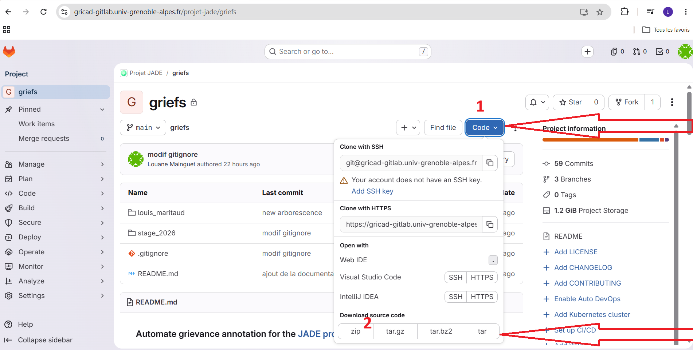

### Automate grievance annotation for the [JADE project](https://blogdudroitelectoral.fr/justice-algorithmique-des-elections-jade/)
## Site web d'annotation

**Pour des non informaticiens (annotateur en droit)**

suivre les 2 étapes du screen ci dessous afin d'obtenir un ZIP


1. decompresser le dossier
2. Dans le dossier decompressé, aller dans stage_2026/site_annotation/dist
3. ouvrir app.exe (double click)
4. **ne rien toucher**, attendre que le site s'affiche tout seul. Une application sur fond noir va s'ouvrir , elle va lancer le navigateur.
(si rien ne se lance en 20sec, il y a un probleme)

**pour les informaticiens**

*L'application python est lancée via un serveur flask. Elle permet la selection d'un fichier json dans l'arborescence du pc*
> etre dans le repertoir **jade_code/griefs/stage_2026/site_annotation**

Pour lancer le serveur de l'application taper la commande ci dessous dans le terminal
```
flask --app app run
```
Puis, ouvrir l'url qui est apres 'Running on'
### Problemes à regler

- Créer une liste déroulante avec les différents XML. Après sélection d'un XML de la liste, affichage d'une liste déroulante avec les considérants de ce XML.
L'objectif est de permettre aux annotateurs de commencer où ils le désirent afin de pouvoir se diviser le travail.
- (pas utile en fonction de ce que décide le conseil, un seul fichier par personne ou plusieurs) Actuellement l'enregistrement s'arrête à indexXmlFin +1 pour avoir tous les considérants du XML précédent.
Corriger l'enregistrement des considérants annotés pour s'arrêter pile sur le dernier annoté. Sinon, récupérer les index de fin dans le nom du fichier (ou faire une fonction de vérification)
- Permettre de reprendre la correction dans le même fichier json après un save ou générer un nouveau fichier (la méthode actuelle)

### Maintenance du site_annotation

Pour le mode debug il faut aller dans jade_code/griefs/stage_2026/site_annotation
```
flask --debug run
```

Pour recreer un executable, taper dans jade_code\griefs\stage_2026\site_annotation la commande suivante
```
python3 -m PyInstaller --onefile --add-data "templates;templates" --add-data "static;static" app.py
```

**Récupération des données**
> Répertoire **jade_code/griefs/stage_2026/documents**

fichier prenom_nom_indexXmlDebut_indexConsiderantDebut_considerants_annotes_indexXmlFin_indexConsiderantFin.json
exemple : louane_m_0_0_considerants_annotes_0_2.json

tous les considérants qui possédaient un label ont maintenant un label corrigé


## Pipeline creation du dataset
Génération du JSON des données annotées

# Mise en place de l'environnement
> etre dans le repertoir **jade_code/griefs/stage_2026/code**

python validé : version 3.12.3 
environnement Windows et Linux

creation d'un environnement python une seule fois apres le git clone
```
python3 -m venv venv
```

activate python env a chaque fois que vous travaillez sur le projet mais ne faites les installations qu'une fois.
```
source venv/bin/activate
```
vous devez voir : `(venv) louane@ordinateur:~/arborescence/griefs/stage_2026/code`


installer les librairies une seule fois apres la creation de l'environnement python venv
```
python3 -m pip install --break-system-packages -r ../requirement.txt
pip install pandas
```

# Commande à faire pour lancer le projet

activate python env a chaque fois que vous travaillez sur le projet.
un (venv) doit etre present dans votre terminal
```source venv/bin/activate```
vous devez voir : `(venv) louane@ordinateur:~/arborescence/griefs/stage_2026/code`

taper les commandes suivantes dans l'ordre pour lancer les fichiers python
```
python before_training.py
python recup_label.py
python count_label_occurence.py
```
vous pouvez maintenant recuperer les données à utiliser dans considerants_avec_label.json

# Se placer dans JADE_ter/code/Modele
## Modele Antony 
*utilise le dataset considerant_avec_label.json generé par before_training et recup_label grace au données corrigées manuellement*

> etre dans le repertoir **jade_code/griefs/stage_2026/code/Modele**

Lancer Séparation.py -> Prend en entrée considerants_avec_labels.json
```
python Séparation.py
```

Les fichiers utilisés par train_model.py sont désormais créés (train.json, test.json, dev.json)

Lancer train_model.py
```
python train_model.py
```

Le modèle est entrainé, on peut donc lancer plot_seuils.py pour voir rappel, précision et f score
```
python plot_seuils.py
```

Ou lancer predict.py pour faire des précisions sur des nouvelles données (ici data_a_predire.json, créé par séparation.py)
```
python predict.py
```

Les prédictions sont dans predictions_finales.json

---
# arborescence et explication des fichiers
- before_training.py : recuperation des considerants des xml contenus dans les dossiers AN/*/rejet et AN/*/annulation, creation du json output.json associé
- Bert_model.py : modele d'essaie
- count_label_occurence.py : compte le nombre d'occurence de chaque label dans considerants_avec_labels.json
- recup_label.py : traite output.json et documents/recap_0-8_vérification_humaine_AB_AST complète.ods afin d'attribuer un label aux considerants corrigés. Genere considerants_avec_labels.json qui possede une liste des considerants et les labels corrigés associés.

site_annotation
- templates/index.html : page pour la sélection d'un fichier JSON dans le PC
- templates/pick_label.html : page pour la sélection de label à attribuer à un considérant
- app.py : Fichier Python utilisant un serveur Flask pour lancer le site web. Il récupère un fichier JSON, traite le texte qu’il contient, annotateur attribue un label, puis génère un nouveau JSON permettant de poursuivre l’entraînement du modèle

```
[
  {
    "id": "CONSTEXT000017665826",
    "considerants": [
      {
        "numero": 1,
        "text": "Considérant qu'en soulevant un moyen tiré de ce que les procès-verbaux de recensement des votes de certains bureaux font apparaître un excédent dans le nombre des enveloppes et bulletins sans enveloppe trouvés dans l'urne par rapport au nombre des émargements, ...",
        "label": [
          "7. operation prealable au scrutin"
        ],
        "label_corrige": "7. operation prealable au scrutin"
      },   
      {...}
    ]
  },
  {
    "id": "CONSTEXT000017665819",
    "considerants": [
      {
        "numero": 1,
        "text": "",
        "label": [],
        "label_corrige":""
      }
    ]
  }
]
```


